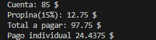
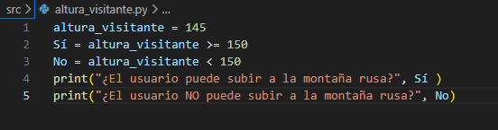
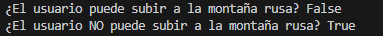
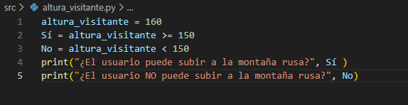
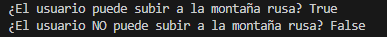

# **Operadores** *️⃣

🧐 Pregunta Orientadora: Piensa en tu día a día. ¿Cuántas veces realizas cálculos mentales (como saber si te alcanza el dinero) o tomas decisiones basadas en condiciones (como "si llueve Y hace frío, llevo abrigo")? ¿Cómo crees que le enseñamos a una computadora a hacer exactamente lo mismo?

- Pienso que al final, por muy complejo que sea un problema, todo se termina resolviendo por una sucesión de decisiones, por ejemplo saber si me alcanza el dinero es pensar primero, que cantidad de dinero cuesta lo que quiero comprar, luego con ese dato preguntarme cuanto dinero poseo, si el dinero que poseo es mayor o igual de lo que cuesta algo, pues ya se que si me alcanza, a una computadora eso se lo puedo representar con datos de entrada y con (lo que me imagino que es un operador) instrucciones matemáticas como por ejemplo mayor que >.
## 1.  Operadores Aritméticos 🧮

|Operador |	Descripción	|Ejemplo mental|
|---|---|---|
|+|	Suma|	5 + 2 = 7|
|-|	Resta|	5 - 2 = 3|
|*|	Multiplicación	|5 * 2 = 10|
|/|	División (resultado decimal)	|5 / 2 = 2.5|
|//|	División entera| (ignora decimales)|	5 // 2 = 2|
|%|	Módulo (residuo de la división)|	5 % 2 = 1|
|**	|Potenciación|	5 ** 2 = 25|

> 💡 **Ejercicio 1: La cuenta del restaurante**
Imagina que fuiste a cenar con 3 amigos (son 4 en total). La cuenta fue de $85. Además, quieren dejar un 15% de propina.
Escribe un programa en Python que calcule:
> 
> 1. El total de la propina.
> 2. El total a pagar (cuenta + propina).
> 3. Cuánto debe pagar cada uno, dividiendo en partes iguales.
> 
> 📤 **Acción en Bitácora:** Crea un archivo llamado `ejercicio1_aritmetica.py`, resuelve el problema y sube el código junto con una captura de pantalla de la ejecución a la bitácora de tu repositorio.
>

## 2. Operadores Relacionales (Comparación) ⚖️

|Operador|	Descripción|	Ejemplo (x=5, y=10)|
|---|---|---|
|==	|Igual que (¡Ojo! Son dos símbolos =)|	x == y (False)|
|!=|	Diferente que	|x != y (True)|
|>	|Mayor que	|x > y (False)|
|<|	Menor que	|x < y (True)|
|>=|	Mayor o igual que	|x >= 5 (True)|
|<=	|Menor o igual que|	y <= 5 (False)|

> 💡 **Ejercicio 2: El guardián de la montaña rusa**
Para subir a la nueva montaña rusa del parque, los visitantes deben medir al menos 150 cm.
Escribe un programa donde declares una variable `altura_visitante` (asígnale el valor que quieras). Luego, utiliza un operador relacional para imprimir `True` si puede subir o `False` si no puede.
> 
> 
> 📤 **Acción en Bitácora:** Escribe tu solución, pruébala con una altura de 145 y otra de 160. Sube tus hallazgos a la bitácora de tu repositorio.
>
  
**Salida:**  

  
**Salida:**  

## 3. Operadores Lógicos 🧠  

|Operador|	Descripción|	¿Cuándo es True?|
|---|---|---|
|and|	Y lógico	|Solo si AMBAS condiciones son verdaderas.|
|or	|O lógico|	Si AL MENOS UNA de las condiciones es verdadera.|
|not	|NO lógico (Inversión)|	Invierte el valor (de True a False y viceversa).|

> 💡 **Ejercicio 3: Sistema de Becas**
Una universidad otorga becas a los estudiantes si cumplen **alguna** de estas dos condiciones:
> 
> - Tener un promedio mayor o igual a 9.0.
> - Estar en un nivel socioeconómico nivel 1 **Y** tener un promedio mayor a 8.0.
> 
> 📤 **Acción en Bitácora:** Diseña la lógica en Python utilizando variables y operadores relacionales y lógicos. Sube tu análisis y código a la bitácora de tu repositorio explicando cómo funciona la evaluación de tu programa.
>

- Primero definimos la variable "promedio" que sera introducida por el usuario y sera de tipo flotante. Seguido de ella la variable "socio_economico" la cual también sera introducida por el usuario y además sera de tipo entero. Creamos la variable "BecaPro" la cual toma en cuenta la primera condición y solo sera verdadera si promedio es mayor o igual a 9.0. Después la variable "BecaNiv" la que toma en cuenta la segunda condición y solo será verdadera si "socio_economico" es igual a 1 y promedio es mayor a 8.0. Finalmente la variable BecaSi solo sera verdadera si BecaPro es verdadera o si BecaSi es verdadera, por ende si ambas son falsas, BecaSi sera falsa. Al final se muestra en pantalla la pregunta "¿Tiene beca?, que sera verdadero o falso dependiendo de BecaSi.

## 🚀 Reto Final de la Semana

> 🏆 **Reto Final: El Validador de Videojuegos**
> 
> 
> Estás programando la lógica de una tienda de videojuegos en línea. Un usuario quiere comprar un juego de clasificación "M" (Mature / Para mayores de 17 años) que cuesta $60.
> 
> Crea un programa que declare las siguientes variables:
> 
> - `edad_usuario` (asigna un número)
> - `saldo_billetera` (asigna un número decimal)
> - `tiene_suscripcion_premium` (asigna `True` o `False`)
> 
> Tu programa debe evaluar y guardar en una variable llamada `compra_exitosa` (que será True o False) si el usuario puede comprar el juego.
> 
> **Condiciones para que la compra sea exitosa:**
> 
> 1. El usuario debe tener al menos 17 años.
> 2. El usuario debe tener suficiente saldo en su billetera. ¡Pero atención! Si tiene suscripción premium, el juego tiene un 10% de descuento.
> 
> *Pista: Primero calcula el precio final usando operadores aritméticos y luego evalúa la lógica con operadores relacionales y lógicos.*
> 
> 📤 **Acción en Bitácora:** Sube el código de tu Reto Final a tu repositorio en un archivo llamado `reto_operadores.py`. En tu archivo Markdown de bitácora, explica brevemente qué se te dificultó más de este reto y cómo lo resolviste. ¡Mucho éxito!
>
